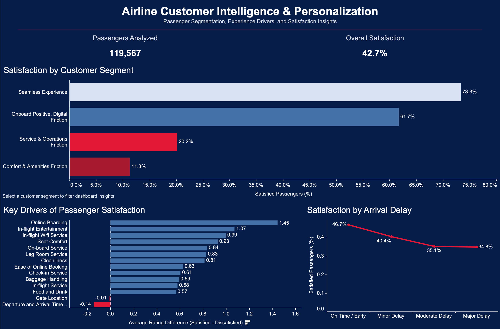

# Airline Customer Intelligence & Personalization

A customer analytics project analyzing airline passenger satisfaction to identify key experience drivers, develop customer segments, predict satisfaction, and translate findings into actionable business recommendations.



## Project Overview

Airlines collect large amounts of customer experience data, but turning that data into actionable insights requires understanding both **what drives satisfaction** and **how different customer groups experience the journey**.

This project analyzes airline passenger satisfaction data to answer four business questions:

1. Which aspects of the passenger experience are most associated with satisfaction?
2. Can passengers be grouped into meaningful experience-based customer segments?
3. How accurately can passenger satisfaction be predicted?
4. How can these insights support more targeted customer experience and personalization strategies?

The project combines exploratory data analysis, K-Means clustering, classification modeling, and an interactive Tableau dashboard.

## Dataset

The original dataset contains **129,880 passenger records** with demographic, travel, operational, and service-experience variables.

After preprocessing for the customer segmentation analysis, **119,567 passenger records** were retained for the dashboard and clustering analysis.

Key variables include:

- Customer type and type of travel
- Travel class
- Flight distance
- Departure and arrival delays
- Online boarding and booking experience
- In-flight Wi-Fi and entertainment
- Seat comfort and leg room
- Check-in and onboard service
- Baggage handling and cleanliness
- Overall passenger satisfaction

**Source:** [Airline Passenger Satisfaction — Kaggle](https://www.kaggle.com/datasets/mysarahmadbhat/airline-passenger-satisfaction/data)

## Methodology

### 1. Data Preparation & Exploratory Analysis

The dataset was cleaned and explored in Python using pandas and NumPy. The analysis examined missing values, satisfaction distributions, customer characteristics, travel behavior, service ratings, and operational factors such as delays.

Initial analysis revealed substantial differences in satisfaction across travel type, customer type, and cabin class.

### 2. Customer Segmentation with K-Means

K-Means clustering was used as an unsupervised machine learning technique to identify groups of passengers with similar experience patterns.

The resulting clusters were analyzed and translated into four business-friendly customer segments:

| Customer Segment | Passengers | Satisfaction Rate |
| --- | ---: | ---: |
| Seamless Experience | 29,159 | 73.3% |
| Onboard Positive, Digital Friction | 33,346 | 61.7% |
| Service & Operations Friction | 29,290 | 20.2% |
| Comfort & Amenities Friction | 27,772 | 11.4% |

These segments make it possible to move beyond an average passenger profile and identify distinct experience patterns that could support more targeted interventions.

### 3. Satisfaction Prediction

Two supervised classification models were evaluated for predicting passenger satisfaction:

| Model | Accuracy | ROC-AUC | Macro F1 |
| --- | ---: | ---: | ---: |
| Logistic Regression | 89.06% | 0.956 | 0.89 |
| Random Forest | **95.83%** | **0.993** | **0.96** |

Random Forest achieved stronger predictive performance across all three evaluation metrics.

For the Random Forest model, precision and recall were also strong across both satisfaction classes:

- Neutral/Dissatisfied: **0.95 precision, 0.98 recall**
- Satisfied: **0.97 precision, 0.93 recall**

### 4. Satisfaction Drivers

Feature analysis from both modeling approaches highlighted several influential aspects of the passenger experience.

Among the strongest factors were:

- Online boarding
- In-flight Wi-Fi service
- Type of travel
- Travel class
- In-flight entertainment
- Seat comfort
- Customer type
- Leg room service

Online boarding was the highest-importance feature in the Random Forest model, while digital experience variables also appeared prominently in the Logistic Regression results.

> **Note:** Model feature importance indicates predictive usefulness and should not be interpreted as proof of causation.

## Key Business Insights

**Digital experience emerged as an important satisfaction signal.** Online boarding and in-flight Wi-Fi were important predictors of satisfaction, suggesting that the passenger experience extends well beyond traditional onboard service.

**Passenger needs are not uniform.** Satisfaction ranged from approximately **11% to 73% across the four customer segments**, demonstrating why aggregate satisfaction alone can hide important differences in the customer experience.

**Some passengers report positive onboard experiences while encountering digital friction.** This segment had a relatively high **61.7% satisfaction rate**, suggesting an opportunity to improve digital touchpoints without necessarily redesigning the entire travel experience.

**Service and operational friction represents a substantially different experience pattern.** The low satisfaction rate within this segment suggests that service and operational issues should be considered separately from comfort- or amenity-related problems.

**Predictive modeling can help identify satisfaction risk.** The Random Forest model achieved **95.83% test accuracy and a 0.993 ROC-AUC**, demonstrating strong predictive performance on the held-out test data.

## Business Recommendations

Based on the analysis, an airline could:

- Prioritize improvements to high-impact digital touchpoints such as online boarding and in-flight connectivity.
- Use customer segmentation to tailor experience improvements instead of applying the same strategy to every passenger.
- Target the **Onboard Positive, Digital Friction** segment with digital-experience improvements while preserving the onboard factors already working well.
- Investigate service and operational pain points for the **Service & Operations Friction** segment.
- Focus comfort and amenity improvements on passengers exhibiting the **Comfort & Amenities Friction** experience pattern.
- Use predictive models as decision-support tools to help identify passengers or experience patterns associated with dissatisfaction.

## Tableau Dashboard

The interactive Tableau dashboard translates the analysis into an executive-facing customer intelligence view.

It includes:

- Overall satisfaction and passenger KPIs
- Customer segment satisfaction comparison
- Passenger volume by segment
- Key experience drivers
- Arrival-delay analysis
- Interactive filtering by customer segment

The packaged Tableau workbook is available here:

[`Airline_Customer_Intelligence_Dashboard.twbx`](Airline_Customer_Intelligence_Dashboard.twbx)

## Tools & Technologies

- **Python**
- **pandas & NumPy** — data preparation and analysis
- **scikit-learn** — K-Means clustering, Logistic Regression, and Random Forest
- **matplotlib** — data visualization
- **Tableau** — interactive business intelligence dashboard
- **Jupyter Notebook / VS Code**
- **Git & GitHub**

## Running the Analysis

Clone the repository and install the required Python packages:

```bash
pip install -r requirements.txt
```

Then open:

```text
notebooks/airline_customer_intelligence.ipynb
```

The notebook uses relative file paths so the analysis can be run directly from the repository.

## Project Takeaway

This project demonstrates a customer analytics workflow. Transforming raw passenger data into exploratory insights, identifying customer segments through machine learning, developing predictive satisfaction models, and communicating the results through an interactive business intelligence dashboard.

The analysis shows how customer experience data can be used to identify distinct passenger needs and support targeted experience strategies.